# Personal collection of (mostly free) fonts

> Everyone has a favorite font, right? RIGHT!?

This is just a personal and opinionated collection of fonts that stuck with me and an excuse to show off the font_specimen_generator.py (I asked Claude to cobble together). This list is also influenced by [Teuderun](https://www.teuderun.de/schriftarten/top-10/). 

List of Font. In no specific order.

## Table of Contents  
* Serif fonts
    - [Literata](#literata)
    - [IBM Plex Serif](#ibm-plex-serif)
    - [Libertinus](#libertinus)
* Sans Serif font
    - [Atkinson Hyperlegible](#atkinson-hyperlegible)
    - [IBM Plex Sans](#ibm-plex-sans)
    - [Inter](#inter)
    - [Metropolis](#metropolis)
    - [Fira Sans](#fira-sans)
* Mono spaced fonts
    - [JetBrains Mono](#jetbrains-mono)
    - [Fira Code](#fira-code)
    - [Maple Mono](#maple-mono)
    - [Cascadia Code](#casadia-code)
* Very nice to have
    - [Titillium](#titillium)
    - [Jost](#jost)
    - [Overpass](#overpass)
* The classic must haves
    - [Tex Gyre Collection](#tex-gyre)
    - [Cormorant Garamond](#cormorant-garamond)
    - [Libre Caslon](#libre-caslon-text)
* Not Comic Sans
    - [Krikikrak](#krikikrak)
    - [Hand of Sean](#hand-of-sean)
    - [Komike Hand](#komika-hand)
# Serif Fonts

### [Literata](https://www.type-together.com/literata-font)
I didn't know of it before I stumbled across Teuderun and I like it a lot.The famlily consists of:
- Literata Display
- Literata Subhead
- Literata Text

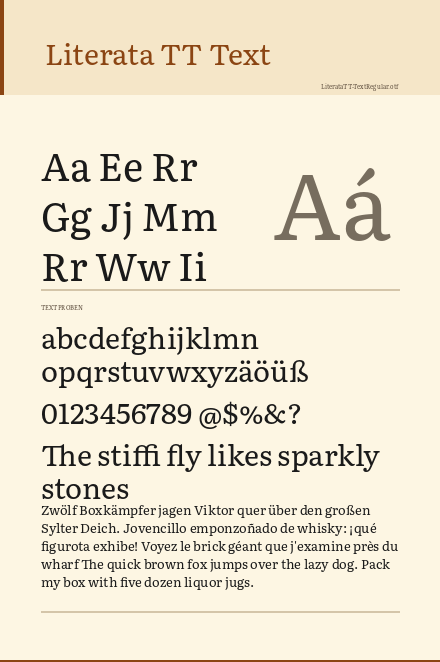

## IBM Plex Serif
I like the IBM Plex fonts a lot. They nail the classic look and are easy to read. Sprinkled with a bit of "tech feel".

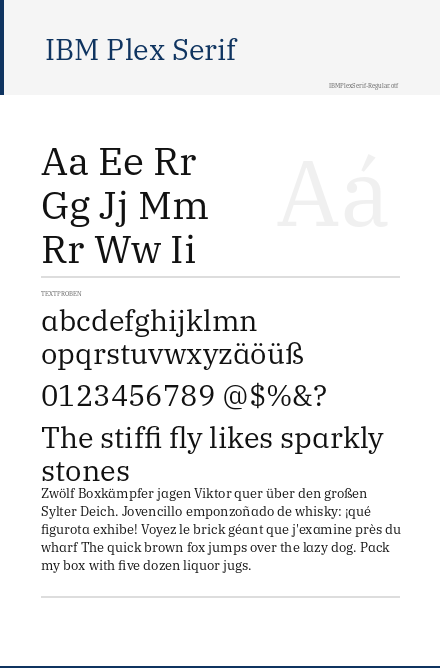

### [Libertinus](https://github.com/alerque/libertinus)

Libertinus is the succesor to Linux Liberine from the TeX Gyre collection. The famlily consists of:
- Libertinus Serif
- Libertinus Serif Display
- Libertinus Sans

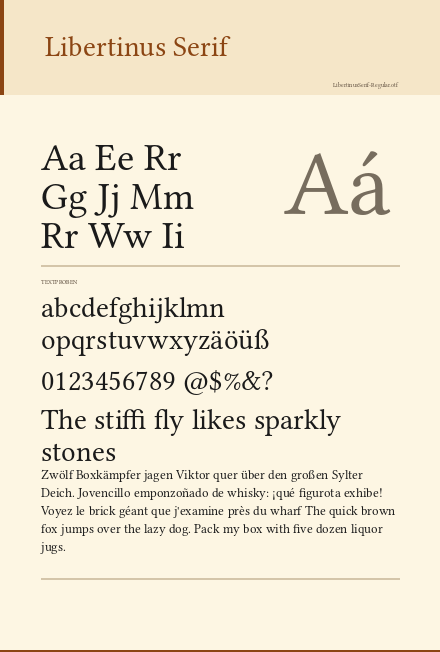

## Sans Serif Fonts

### [Atkinson Hyperlegible](https://www.brailleinstitute.org/freefont/)
Nomen et omen. Very readable. I like it and its growing on me.

Developed by the Braille Institute of America this font is intended to be easily readable for readers who are partially blind, with all characters being as different from each other as possible. 

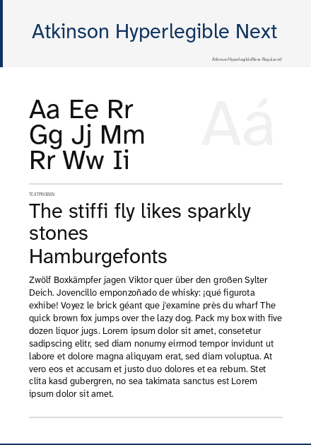

### [Inter](https://rsms.me/inter/)
As the website puts it: "The 21st century standard". Also available as a variable font.

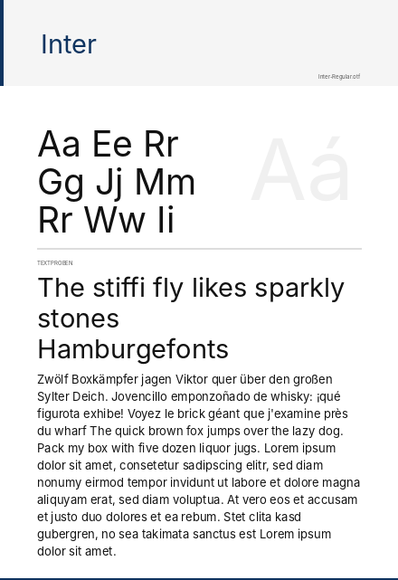

### [Metropolis](https://github.com/dw5/Metropolis)
I like this one for headers and larger text.

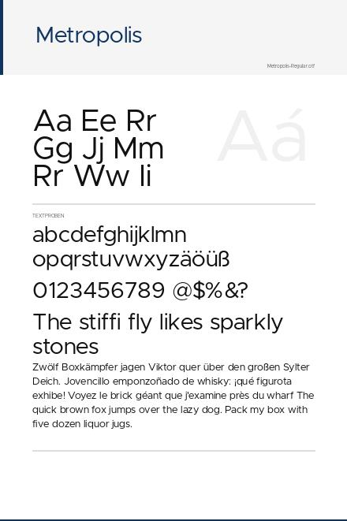

### [Titillium](http://nta.accademiadiurbino.it/titillium/)

For when you need a slightly different look.

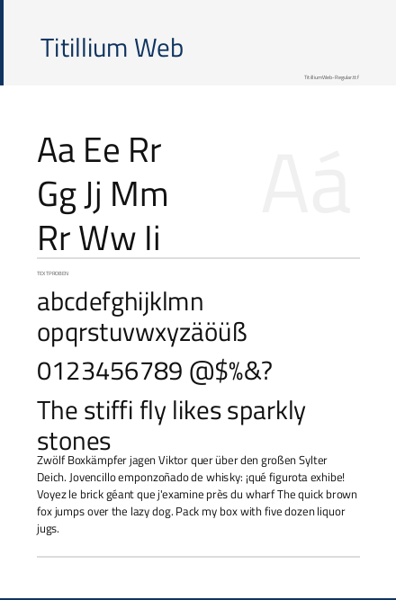

# Mono

### [JetBrains Mono](https://github.com/jetbrains/jetbrainsmono)

It's just pleasant to my eyes.

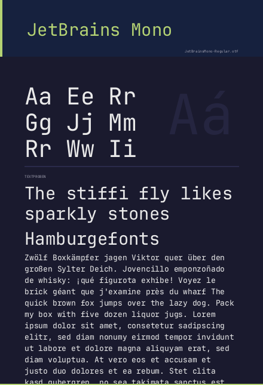

### [Maple Mono](https://font.subf.dev/en/download/)

I'm tying to befriend it.

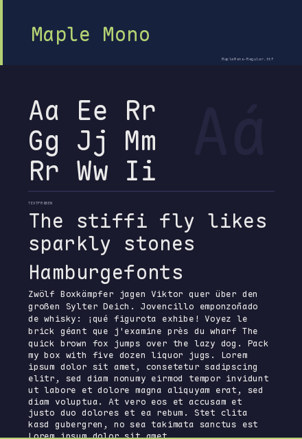

### [Fira Code](https://github.com/tonsky/FiraCode)

My former monotype font. I sadly leave it behind, but JetBrains Mono is just nicer to stare at.

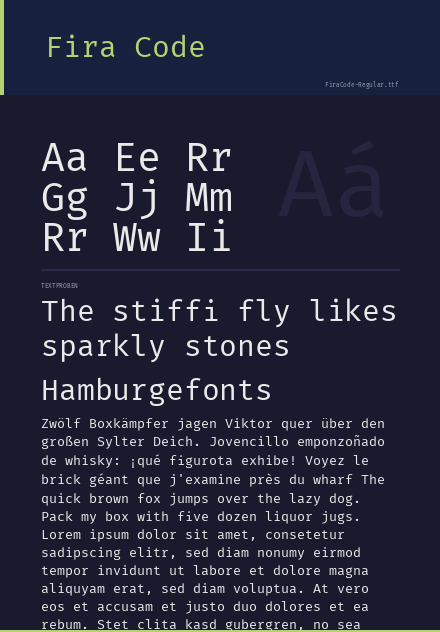

### [Cascadia Code](https://github.com/microsoft/cascadia-code)

Basically just for its cursive variant for the comments.

# Honorable Mentions

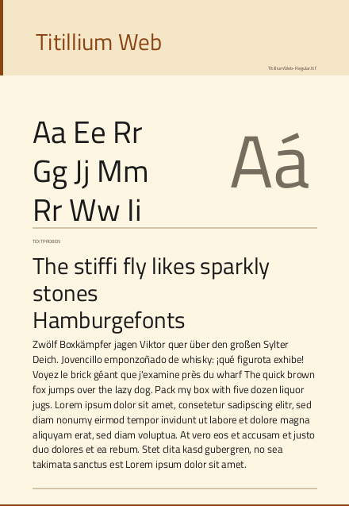

### [Jost](https://github.com/indestructible-type/Jost)

A little more fancy Futura

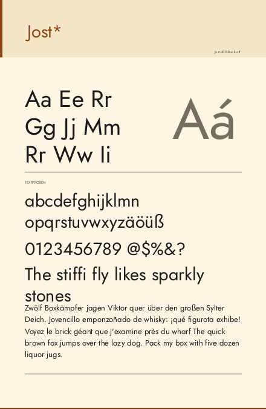

### [IBM Plex Sans](https://github.com/IBM/plex)

The IBM Plex font family is just a nice and very readable font.

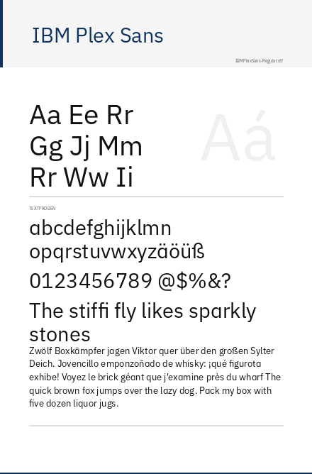

### [Fira Sans](https://mozilla.github.io/Fira/)

Comissioned by The Mozilla Foundation and Telefonica S.A for their mobile OS. Very similar to Erik Spiekermanns "FF Meta".

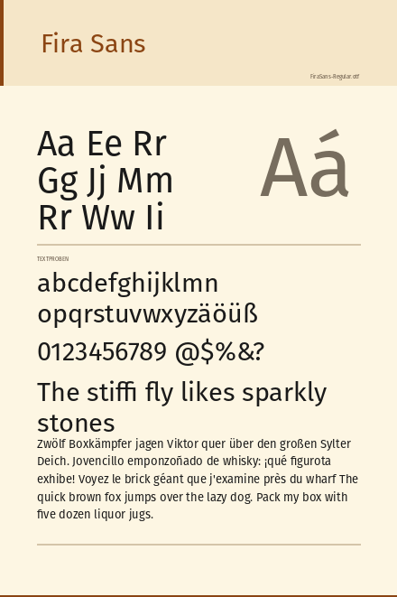

### [Overpass](https://overpassfont.org/)
Open-source font inspired by Highway Gothic on american road signs. 

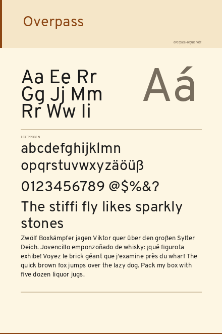

## The classics
These are just the classics.

### [Tex Gyre](https://www.gust.org.pl/projects/e-foundry/tex-gyre/)
Free alternatives for:
* Times (New) Roman → TeX Gyre Termes
* ITC Avantgarde → TeX Gyre Adventor
* Century Schoolbook → TeX Gyre Schola
* Palatino → Pagella
* ITC Zapf Chancery(R) → Tex Gyre Chorus
* ITC Bookman → TeX Gyre Bonum
* Courier → TeX Gyre Cursor
* Helvetica → TeX Gyre Heros

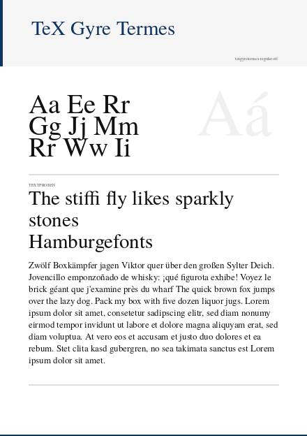 
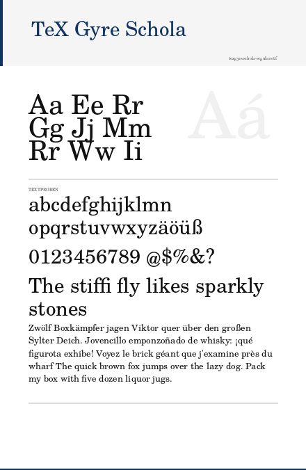 
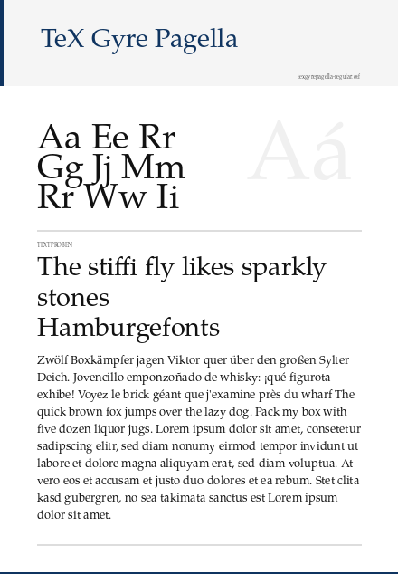 
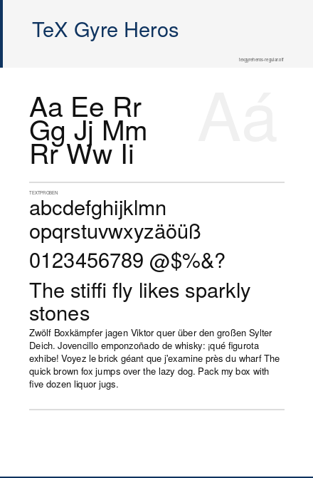 
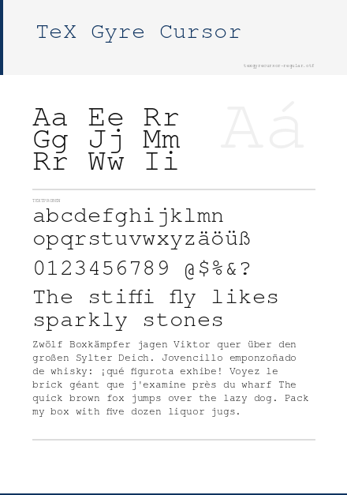 
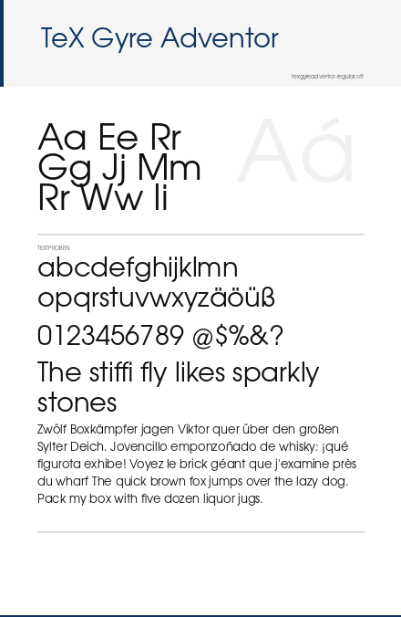 
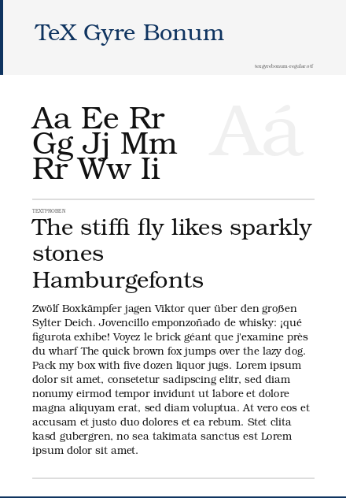 

### [Cormorant Garamond](https://github.com/CatharsisFonts/Cormorant)
Didn't knew of before Teuderun and I like it a lot.

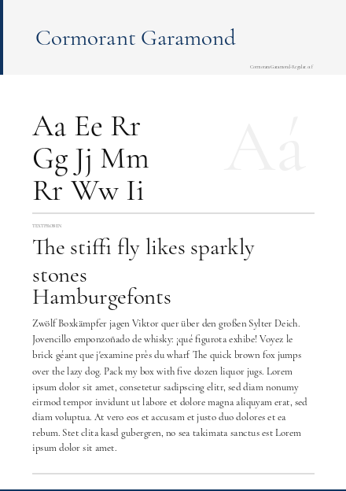

### [Libre Caslon Text](https://github.com/impallari/Libre-Caslon-Text/)
Caslon clone specifically optimized for web body text. Also available as [Libre Caslon Display](https://github.com/impallari/Libre-Caslon-Display/)

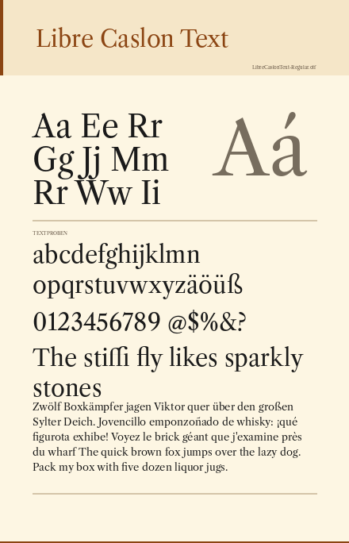

## Not Comic Sans

The _only_ appropriate use of "Comic Sans" according to [Comic Sans Criminal](https://comicsanscriminal.com/):

> * Your audience is under 11 years old
> * You're designing a comic
> * Your audience is dyslexic and has stated that they prefer comic sans

Jokes aside: Comic Sasn doesn't hurt people, people hurt people.

### [Krikikrak](https://www.carrois.com/typefaces/retail/Krikikrak/)
If you are thinking _Comic Sans_ why not fully embrace the inner child and use Krikikraki?

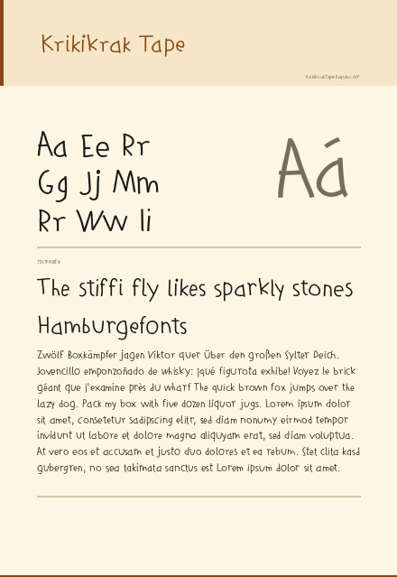

### [Hand of Sean](https://www.dafont.com/hand-of-sean.font)
Personal favorite of the freehand fonts

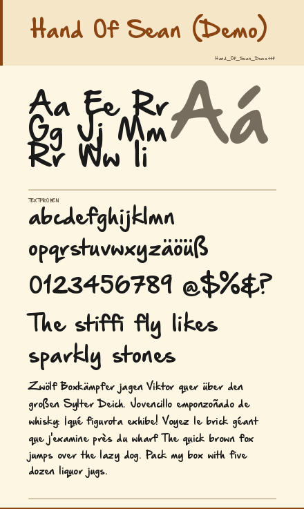

### [Komika Hand](https://www.1001fonts.com/komika-font.html)
Nobody has to use comic sans, but you could go full comic mode.

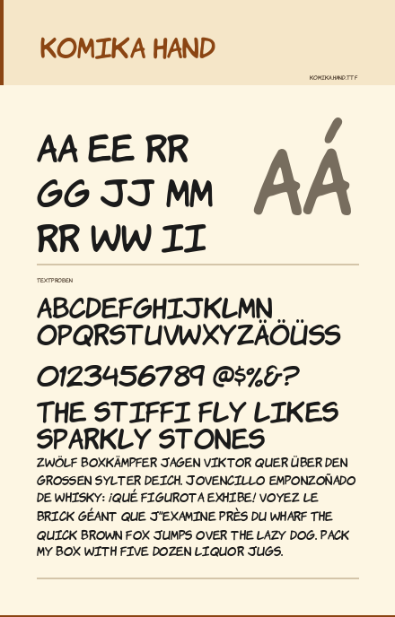

### [Kalam](https://fonts.google.com/specimen/Kalam)

Don' use it. It might become the new Comic Sans.

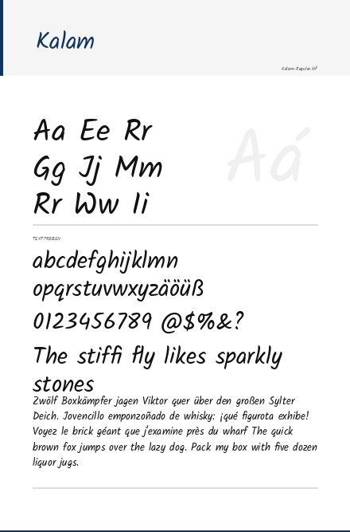

## python font_specimen_generator.py

Asked Claude to cobble together a python script to generate the font specimen preview inspired by the ones on [Wikipedia](https://commons.wikimedia.org/wiki/Category:Typeface_samples_(Font_Specimen_Creator);_raster_graphics)

###

    python font_specimen_generator.py --input ./fonts --output ./previews/cream --width 640 --theme cream --overwrite && python font_specimen_generator.py --input ./fonts --output ./previews/dark --width 640 --theme dark --overwrite && python font_specimen_generator.py --input ./fonts --output ./previews/light --width 640 --theme  white --overwrite

