# Persönliche Sammlung von (größtenteils kostenlosen) Schriftarten

> Jeder hat eine Lieblingsschrift, oder? ODER!?

Das ist eine persönliche und eigenwillige Sammlung von Schriftarten, die mir im Gedächtnis geblieben sind und vor allem und ein Vorwand, den [font_specimen_generator.py](./font_specimen_generator.py) vorzuführen (den ich Claude zusammen schustern ließ). Diese Liste ist außerdem von [Teuderun](https://www.teuderun.de/schriftarten/top-10/) beeinflusst.


## Neue Schrift hinzufügen

### Notwendige Schritte

1. **Ordner anlegen** — `src/webfonts/<Kategorie>/<SchriftName>/`
   Der Ordner ist reiner Dateisystem-Container — er hat keinen Einfluss auf URL oder Navigation.

2. **`.woff2`-Dateien ablegen** — Namensschema: `SchriftName_Gewicht.woff2`
   Beispiele: `Jost_Regular.woff2`, `Jost_Bold.woff2`, `Jost_BoldItalic.woff2`
   Variable Fonts: Dateiname muss `Variable`, ein `_vf`-Suffix oder eine Achsenliste in
   eckigen Klammern enthalten — `[wght]`, `[opsz,wght]`, `[MONO,CASL,wght,slnt,CRSV]`.
   Beliebige vierstellige Achsen-Tags sind erlaubt, nicht nur die fünf registrierten.

3. **`meta.yaml` erstellen** — Pflicht: `tags` (erster Tag bestimmt URL-Segment und Kategorie)
   ```yaml
   title: Meine Schrift
   tags: Sans, Humanist Sans      # erster Tag → URL /sans/meineschrift.html
   ```

4. **Build starten** — `npx gulp`
   Die Specimen-Seite erscheint automatisch unter `/<erster-tag>/<schriftname>.html`.

---

### Optionale meta.yaml-Felder

| Feld | Beispiel | Wirkung |
|---|---|---|
| `color` | `steelblue` | Akzentfarbe (CSS-Farbname) |
| `heroword` | `Airport` | Großes Wort im Hero-Bereich |
| `heroletter` | `Aa` | Zeichen im CMYK-Hero |
| `herostyle` | `bold` | CSS font-weight für heroword |
| `border` | `floral.svg` | Rahmen-SVG (aus `src/img/borders/`) |
| `fontauthor` | `Rasmus Andersson` | Gestalter-Name |
| `fontyear` | `2017` | Erscheinungsjahr |
| `wikipedia` | `https://…` | Link zur Wikipedia-Seite |
| `content` | `Markdown-Text` | Freitext unter dem Specimen |
| `comment` | `interner Hinweis` | Interne Notiz, unter dem Header angezeigt |
| `license` | `SIL Open Font License 1.1` | Überschreibt die Auto-Erkennung aus `OFL.txt`/`LICENSE.txt` |
| `favorite` | `true` | Goldener Stern auf Karte und Specimen-Seite |
| `url` | `https://…` | Projekt-/Quelllink (im Template `folder.sourceUrl`) |

### Optionale Bilder

- **Kartenhintegrund** — Bilder in `src/webfonts/<Kat>/<Schrift>/background/` ablegen (WebP bevorzugt)
  Oder URLs in `background/urls.txt` eintragen (`unsplash:ID`, `pexels:ID`, direkte HTTPS-URL) → `npx gulp download`
- **Galerie** — Bilder in `src/webfonts/<Kat>/<Schrift>/gallery/` ablegen

---

### Lokalen Server starten

```bash
git clone https://github.com/elbym/font-collection
npm install
npx gulp            # Entwicklungsserver auf Port 3000
npx gulp build      # Produktions-Build
npx gulp deploy     # Deploy auf GitHub Pages
```

## Schriften

Aktuell **122 Schriften** mit Specimen-Seite. Die Gliederung folgt dem jeweils
ersten Tag in der `meta.yaml` — der bestimmt auch die URL. Diese Liste ist aus dem
Datenlayer generiert; beim Hinzufügen einer Schrift mit aktualisieren.

### Serif (38)
[Alegreya](https://elbym.github.io/font-collection/serif/alegreya.html) · [Arvo](https://elbym.github.io/font-collection/serif/arvo.html) · [Basteleur](https://elbym.github.io/font-collection/serif/basteleur.html) · [Bevan](https://elbym.github.io/font-collection/serif/bevan.html) · [Bitter](https://elbym.github.io/font-collection/serif/bitter.html) · [Bodoni\*](https://elbym.github.io/font-collection/serif/bodoni.html) · [Compagnon](https://elbym.github.io/font-collection/serif/compagnon.html) · [Cormorant](https://elbym.github.io/font-collection/serif/cormorant.html) · [Crimson Pro](https://elbym.github.io/font-collection/serif/crimsonpro.html) · [EB Garamond](https://elbym.github.io/font-collection/serif/ebgaramond.html) · [Frank Ruhl Libre](https://elbym.github.io/font-collection/serif/frankruhllibre.html) · [Fraunces](https://elbym.github.io/font-collection/serif/fraunces.html) · [Gambetta](https://elbym.github.io/font-collection/serif/gambetta.html) · [GFS Didot](https://elbym.github.io/font-collection/serif/gfsdidot.html) · [IBM Plex Serif](https://elbym.github.io/font-collection/serif/ibmplexserif.html) · [Junicode](https://elbym.github.io/font-collection/serif/junicode.html) · [Libertinus Serif](https://elbym.github.io/font-collection/serif/libertinusserif.html) · [Libre Baskerville](https://elbym.github.io/font-collection/serif/librebaskerville.html) · [Libre Caslon](https://elbym.github.io/font-collection/serif/librecaslon.html) · [Literata](https://elbym.github.io/font-collection/serif/literata.html) · [Lora](https://elbym.github.io/font-collection/serif/lora.html) · [Merriweather](https://elbym.github.io/font-collection/serif/merriweather.html) · [Mozilla Headline](https://elbym.github.io/font-collection/serif/mozillaheadline.html) · [Newsreader](https://elbym.github.io/font-collection/serif/newsreader.html) · [Piazzolla](https://elbym.github.io/font-collection/serif/piazzolla.html) · [Playfair](https://elbym.github.io/font-collection/serif/playfair.html) · [Reforma](https://elbym.github.io/font-collection/serif/reforma.html) · [Sentient](https://elbym.github.io/font-collection/serif/sentient.html) · [Source Serif](https://elbym.github.io/font-collection/serif/sourceserif.html) · [Spectral](https://elbym.github.io/font-collection/serif/spectral.html) · [Tex Gyre Bonum](https://elbym.github.io/font-collection/serif/texgyrebonum.html) · [Tex Gyre Pagella](https://elbym.github.io/font-collection/serif/texgyrepagella.html) · [Tex Gyre Schola](https://elbym.github.io/font-collection/serif/texgyreschola.html) · [Tex Gyre Termes](https://elbym.github.io/font-collection/serif/texgyretermes.html) · [Unna](https://elbym.github.io/font-collection/serif/unna.html) · [Vollkorn](https://elbym.github.io/font-collection/serif/vollkorn.html) · [Zilla Slab](https://elbym.github.io/font-collection/serif/zillaslab.html) · [Zodiak](https://elbym.github.io/font-collection/serif/zodiak.html)

### Sans-Serif (38)
[Amstelvar](https://elbym.github.io/font-collection/sans/amstelvar.html) · [Asap](https://elbym.github.io/font-collection/sans/asap.html) · [Atkinson Hyperlegible Next](https://elbym.github.io/font-collection/sans/atkinsonhyperlegiblenext.html) · [Bricolage Grotesque](https://elbym.github.io/font-collection/sans/bricolagegrotesque.html) · [Cabinet Grotesk](https://elbym.github.io/font-collection/sans/cabinetgrotesk.html) · [Cooper Hewitt](https://elbym.github.io/font-collection/sans/cooperhewitt.html) · [DINish](https://elbym.github.io/font-collection/sans/dinish.html) · [Epilogue](https://elbym.github.io/font-collection/sans/epilogue.html) · [Figtree](https://elbym.github.io/font-collection/sans/figtree.html) · [Fira Sans](https://elbym.github.io/font-collection/sans/firasans.html) · [Geist](https://elbym.github.io/font-collection/sans/geist.html) · [IBM Plex Sans](https://elbym.github.io/font-collection/sans/ibmplexsans.html) · [Inter](https://elbym.github.io/font-collection/sans/inter.html) · [Jost\*](https://elbym.github.io/font-collection/sans/jost.html) · [Karrik](https://elbym.github.io/font-collection/sans/karrik.html) · [League Spartan](https://elbym.github.io/font-collection/sans/leaguespartan.html) · [Libertinus Sans](https://elbym.github.io/font-collection/sans/libertinussans.html) · [Libre Franklin](https://elbym.github.io/font-collection/sans/librefranklin.html) · [Manrope](https://elbym.github.io/font-collection/sans/manrope.html) · [Metropolis](https://elbym.github.io/font-collection/sans/metropolis.html) · [Mozilla Text](https://elbym.github.io/font-collection/sans/mozillatext.html) · [Nunito](https://elbym.github.io/font-collection/sans/nunito.html) · [Overpass](https://elbym.github.io/font-collection/sans/overpass.html) · [Playpen Sans](https://elbym.github.io/font-collection/sans/playpensans.html) · [Public Sans](https://elbym.github.io/font-collection/sans/publicsans.html) · [Quicksand](https://elbym.github.io/font-collection/sans/quicksand.html) · [Raleway](https://elbym.github.io/font-collection/sans/raleway.html) · [Roboto Flex](https://elbym.github.io/font-collection/sans/robotoflex.html) · [Routed Gothic](https://elbym.github.io/font-collection/sans/routedgothic.html) · [Satoshi](https://elbym.github.io/font-collection/sans/satoshi.html) · [Source Sans](https://elbym.github.io/font-collection/sans/sourcesans.html) · [Space Grotesk](https://elbym.github.io/font-collection/sans/spacegrotesk.html) · [Tex Gyre Adventor](https://elbym.github.io/font-collection/sans/texgyreadventor.html) · [Tex Gyre Heros](https://elbym.github.io/font-collection/sans/texgyreheros.html) · [Titillum Web](https://elbym.github.io/font-collection/sans/titillumweb.html) · [Varela Round](https://elbym.github.io/font-collection/sans/varelaround.html) · [Vazirmatn](https://elbym.github.io/font-collection/sans/vazirmatn.html) · [Work Sans](https://elbym.github.io/font-collection/sans/worksans.html)

### Monospace (15)
[0xProto](https://elbym.github.io/font-collection/monospace/0xproto.html) · [Cascadia Code](https://elbym.github.io/font-collection/monospace/cascadiacode.html) · [Courier Prime](https://elbym.github.io/font-collection/monospace/courierprime.html) · [Departure Mono](https://elbym.github.io/font-collection/monospace/departuremono.html) · [Fira Code](https://elbym.github.io/font-collection/monospace/firacode.html) · [Geist Mono](https://elbym.github.io/font-collection/monospace/geistmono.html) · [Hack](https://elbym.github.io/font-collection/monospace/hack.html) · [IBM Plex Mono](https://elbym.github.io/font-collection/monospace/ibmplexmono.html) · [JetBrains Mono](https://elbym.github.io/font-collection/monospace/jetbrainsmono.html) · [Libertinus Mono](https://elbym.github.io/font-collection/monospace/libertinusmono.html) · [Maple Mono](https://elbym.github.io/font-collection/monospace/maplemono.html) · [Recursive](https://elbym.github.io/font-collection/monospace/recursive.html) · [Source Code Pro](https://elbym.github.io/font-collection/monospace/sourcecodepro.html) · [TeX Gyre Cursor](https://elbym.github.io/font-collection/monospace/texgyrecursor.html) · [Victor Mono](https://elbym.github.io/font-collection/monospace/victormono.html)

### Script / Handschrift (18)
[Amatic SC](https://elbym.github.io/font-collection/script/amaticsc.html) · [Because We Build](https://elbym.github.io/font-collection/script/becausewebuild.html) · [Because We Connect](https://elbym.github.io/font-collection/script/becauseweconnect.html) · [Because We Create](https://elbym.github.io/font-collection/script/becausewecreate.html) · [Because We Learn](https://elbym.github.io/font-collection/script/becausewelearn.html) · [Because We Mentor](https://elbym.github.io/font-collection/script/becausewementor.html) · [Because We Organize](https://elbym.github.io/font-collection/script/becauseweorganize.html) · [Caveat](https://elbym.github.io/font-collection/script/caveat.html) · [Dancing Script](https://elbym.github.io/font-collection/script/dancingscript.html) · [Great Vibes](https://elbym.github.io/font-collection/script/greatvibes.html) · [Kalam](https://elbym.github.io/font-collection/script/kalam.html) · [Komika](https://elbym.github.io/font-collection/script/komika.html) · [Krikikrak](https://elbym.github.io/font-collection/script/krikikrak.html) · [Pacifico](https://elbym.github.io/font-collection/script/pacifico.html) · [Playwrite](https://elbym.github.io/font-collection/script/playwritedela.html) · [Satisfy](https://elbym.github.io/font-collection/script/satisfy.html) · [Tangerine](https://elbym.github.io/font-collection/script/tangerine.html) · [TeX Gyre Chorus](https://elbym.github.io/font-collection/script/texgyrechorus.html)

### Blackletter (5)
[Grenze](https://elbym.github.io/font-collection/blackletter/grenze.html) · [Grenze Gotisch](https://elbym.github.io/font-collection/blackletter/grenzegotisch.html) · [Jacquarda Bastarda 9](https://elbym.github.io/font-collection/blackletter/jacquardabastarda9.html) · [Unifraktur](https://elbym.github.io/font-collection/blackletter/unifraktur.html) · [UnifrakturCook](https://elbym.github.io/font-collection/blackletter/unifrakturcook.html)

### Display (8)
[Big Shoulders Display](https://elbym.github.io/font-collection/display/bigshouldersdisplay.html) · [Big Shoulders Stencil](https://elbym.github.io/font-collection/display/bigshouldersstencil.html) · [Climate Crisis](https://elbym.github.io/font-collection/display/climatecrisis.html) · [Dela Gothic One](https://elbym.github.io/font-collection/display/delagothicone.html) · [Pixelify Sans](https://elbym.github.io/font-collection/display/pixelifysans.html) · [Saira Stencil One](https://elbym.github.io/font-collection/display/sairastencilone.html) · [Sansita Swashed](https://elbym.github.io/font-collection/display/sansitaswashed.html) · [Silkscreen](https://elbym.github.io/font-collection/display/silkscreen.html)

Die drei Nicht-Comic-Sans-Schriften ([Kalam](https://elbym.github.io/font-collection/script/kalam.html) ·
[Komika](https://elbym.github.io/font-collection/script/komika.html) ·
[Krikikrak](https://elbym.github.io/font-collection/script/krikikrak.html)) liegen im Ordner
`src/webfonts/comicsans/`, sind aber als `Script` getaggt und erscheinen deshalb unter `/script/`.


# Werkzeuge

## Font Freeze
[FontFreeze](https://github.com/MuTsunTsai/fontfreeze): Wenn eine Schriftfunktion standardmäßig aktiviert oder vollständig aus einer Schrift entfernt werden soll. Ich habe es verwendet, um eine Version von „Cascadia Code" mit eingebautem [SS01](https://learn.microsoft.com/en-us/typography/opentype/spec/features_pt#ssxx) zu erstellen.

## python font_specimen_generator.py

Claude gebeten, ein Python-Skript zusammenzubasteln, das Schriftmuster-Vorschauen generiert – inspiriert von den Vorlagen auf [Wikipedia](https://commons.wikimedia.org/wiki/Category:Typeface_samples_(Font_Specimen_Creator);_raster_graphics)


Unterstützt derzeit 3 verschiedene Themes: cream, dark, white

Beispiele:

    python font_specimen_generator.py --input ./fonts --output ./previews
    python font_specimen_generator.py --input ./fonts --output ./previews --theme white
    python font_specimen_generator.py --input ./fonts --output ./previews --width 1400 --theme cream
    python font_specimen_generator.py --input ./fonts --output ./previews --overwrite

---
* Serifenschriften
  - [Literata](#literata)
  - [IBM Plex Serif](#ibm-plex-serif)
  - [Libertinus](#libertinus)
  - [Alegreya](#alegreya)
  - [Arvo](#arvo)
  - [Bitter](#bitter)
  - [Bodoni*](#bodoni)
  - [Cardo](#cardo)
  - [Compagnon](#compagnon)
  - [Crimson Pro](#crimson-pro)
  - [EB Garamond](#eb-garamond)
  - [Fraunces](#fraunces)
  - [Gambetta](#gambetta)
  - [Gentium Plus](#gentium-plus)
  - [GFS Didot](#gfs-didot)
  - [Instrument Serif](#instrument-serif)
  - [Junicode](#junicode)
  - [Libre Baskerville](#libre-baskerville)
  - [Lora](#lora)
  - [Merriweather](#merriweather)
  - [Mozilla Headline](#mozilla-headline)
  - [Newsreader](#newsreader)
  - [Piazzolla](#piazzolla)
  - [Playfair](#playfair)
  - [Quattrocento](#quattrocento)
  - [Reforma](#reforma)
  - [Roslindale](#roslindale)
  - [Sentient](#sentient)
  - [Sorts Mill Goudy](#sorts-mill-goudy)
  - [Source Serif](#source-serif)
  - [Spectral](#spectral)
  - [STIX Two](#stix-two)
  - [Unna](#unna)
  - [Vollkorn](#vollkorn)
  - [Zodiak](#zodiak)
* Serifenlose Schriften
  - [Atkinson Hyperlegible](#atkinson-hyperlegible)
  - [Inter](#inter)
  - [Metropolis](#metropolis)
  - [IBM Plex Sans](#ibm-plex-sans)
  - [Fira Sans](#fira-sans)
  - [Amstelvar](#amstelvar)
  - [Asap](#asap)
  - [Barlow](#barlow)
  - [Bricolage Grotesque](#bricolage-grotesque)
  - [Cabinet Grotesk](#cabinet-grotesk)
  - [Chivo](#chivo)
  - [DINish](#dinish)
  - [DM Sans](#dm-sans)
  - [Encode Sans](#encode-sans)
  - [Epilogue](#epilogue)
  - [Figtree](#figtree)
  - [Geist](#geist)
  - [Junction](#junction)
  - [League Spartan](#league-spartan)
  - [Lexend](#lexend)
  - [Libertinus Sans](#libertinus-sans)
  - [Manrope](#manrope)
  - [Mozilla Text](#mozilla-text)
  - [Nunito](#nunito)
  - [Oswald](#oswald)
  - [Outfit](#outfit)
  - [Playpen Sans](#playpen-sans)
  - [Plus Jakarta Sans](#plus-jakarta-sans)
  - [Public Sans](#public-sans)
  - [Raleway](#raleway)
  - [Roboto Flex](#roboto-flex)
  - [Routed Gothic](#routed-gothic)
  - [Satoshi](#satoshi)
  - [Source Sans](#source-sans)
  - [Space Grotesk](#space-grotesk)
  - [Syne](#syne)
  - [Urbanist](#urbanist)
  - [Work Sans](#work-sans)
* Die klassischen Pflichtschriften
  - [Tex Gyre Collection](#tex-gyre)
  - [Cormorant Garamond](#cormorant-garamond)
  - [Libre Caslon](#libre-caslon-text)
* Sehr schön zu haben
  - [Titillium](#titillium)
  - [Jost](#jost)
  - [Overpass](#overpass)
* Nichtproportionale Schriften
  - [JetBrains Mono](#jetbrains-mono)
  - [Maple Mono](#maple-mono)
  - [Fira Code](#fira-code)
  - [Cascadia Code](#cascadia-code)
  - [0xProto](#0xproto)
  - [Commit Mono](#commit-mono)
  - [Departure Mono](#departure-mono)
  - [Geist Mono](#geist-mono)
  - [Hack](#hack)
  - [Monaspace](#monaspace)
  - [Recursive](#recursive)
  - [Space Mono](#space-mono)
  - [Victor Mono](#victor-mono)
* Schreibschriften
  - [Amatic SC](#amatic-sc)
  - [Caveat](#caveat)
  - [Dancing Script](#dancing-script)
  - [Pacifico](#pacifico)
  - [Playwrite](#playwrite)
  - [Sansita Swashed](#sansita-swashed)
  - [Satisfy](#satisfy)
* Display
  - [Anton](#anton)
  - [Anybody](#anybody)
  - [Bebas Neue](#bebas-neue)
  - [Big Shoulders Display](#big-shoulders-display)
  - [Dela Gothic One](#dela-gothic-one)
  - [Silkscreen](#silkscreen)
* Blackletter
  - [Fette Fraktur](#fette-fraktur)
  - [Grenze Gotisch](#grenze-gotisch)
  - [Grenze](#grenze)
  - [Unifraktur](#unifraktur)
* Nicht Comic Sans
  - [Krikikrak](#krikikrak)
  - [Komika Hand](#komika-hand)
  - [Kalam](#kalam)

# Serifenschriften

## Literata
https://www.type-together.com/literata-font

Kannte sie nicht, bevor ich bei Teuderun darauf gestoßen bin – und ich mag sie sehr. Die Familie besteht aus:
* Literata Display
* Literata Subhead
* Literata Text

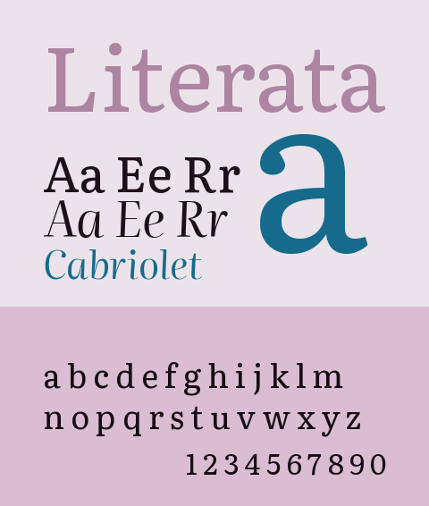

## IBM Plex Serif
https://github.com/IBM/plex

Ich mag die IBM-Plex-Schriften sehr. Sie treffen den klassischen Look und sind gut lesbar. Mit einem Hauch „Tech-Feeling".

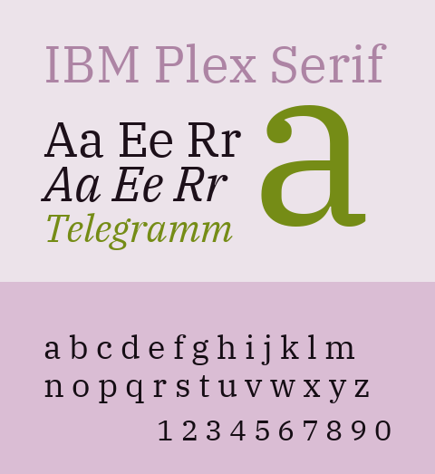

## Libertinus
https://github.com/alerque/libertinus

Libertinus ist der Nachfolger von Linux Libertine aus der TeX-Gyre-Sammlung. Die Familie besteht aus:
* Libertinus Serif
* Libertinus Serif Display
* Libertinus Sans

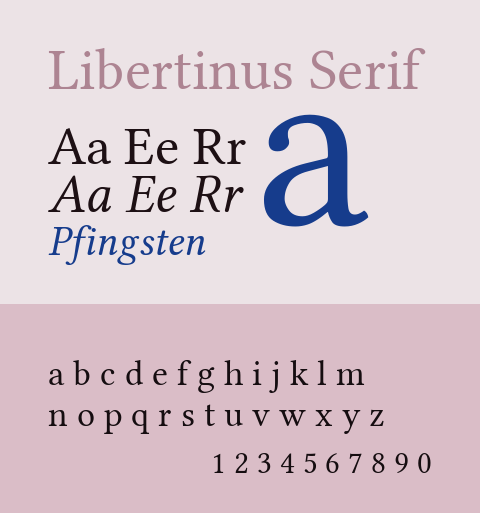

## Alegreya
https://htfonts.com/en/fonts/alegreya-sans/

## Arvo
https://github.com/antonxheight/Arvo

## Basteleur
https://velvetyne.fr/fonts/basteleur/

## Bevan
https://github.com/googlefonts/BevanFont

## Bitter
https://fonts.google.com/specimen/Bitter

## Bodoni*
https://github.com/indestructible-type/Bodoni

## Cardo
https://fonts.google.com/specimen/Cardo

## Compagnon
https://compagnon.eesab.fr/

## Crimson Pro
https://github.com/Fonthausen/CrimsonPro

## EB Garamond
https://googlefonts.github.io/ebgaramond-specimen

## Frank Ruhl Libre
https://github.com/fontef/frankruhllibre

## Fraunces
https://github.com/undercasetype/Fraunces

## Gambetta
https://www.fontshare.com/fonts/gambetta

## Gentium Plus
https://software.sil.org/gentium

## GFS Didot
https://greekfontsociety-gfs.gr/typefaces/19th_century

## Instrument Serif
https://fonts.google.com/specimen/Instrument+Serif

## Junicode
https://github.com/psb1558/Junicode-font

## Libre Baskerville
https://github.com/impallari/Libre-Baskerville

## Lora
https://github.com/cyrealtype/Lora-Cyrillic

## Merriweather
https://github.com/SorkinType/Merriweather

## Mozilla Headline
https://github.com/mozilla/mozilla-type-family

## Newsreader
https://github.com/productiontype/Newsreader

## Piazzolla
https://github.com/huertatipografica/piazzolla

## Playfair
https://www.forthehearts.net/playfair

## Quattrocento
https://fonts.google.com/specimen/Quattrocento

## Reforma
https://pampatype.com/reforma

## Roslindale
https://fonts.google.com/specimen/Roslindale

## Sentient
https://www.fontshare.com/fonts/sentient

## Sorts Mill Goudy
https://fonts.google.com/specimen/Sorts+Mill+Goudy

## Source Serif
https://adobe-fonts.github.io/source-serif/

## Spectral
https://github.com/productiontype/Spectral

## STIX Two
https://www.stixfonts.org

## Unna
https://www.omnibus-type.com/fonts/unna/

## Vollkorn
http://vollkorn-typeface.com/

## Zilla Slab
https://github.com/mozilla/zilla-slab

## Zodiak
https://www.fontshare.com/fonts/zodiak

# Serifenlose Schriften

## Atkinson Hyperlegible
https://www.brailleinstitute.org/freefont/

Nomen est omen. Sehr gut lesbar. Ich mag sie und sie wächst mir immer mehr ans Herz.

Entwickelt vom Braille Institute of America ist diese Schrift darauf ausgelegt, für sehbehinderte Leser besonders gut lesbar zu sein – alle Zeichen sind so unterschiedlich wie möglich gestaltet.

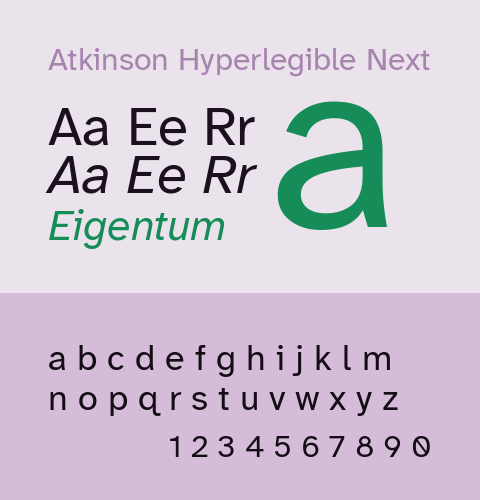

## Inter
https://rsms.me/inter/

Wie die Website es beschreibt: „Der Standard des 21. Jahrhunderts". Hat sogar eine schöne URL. Auch als Variable Font verfügbar.

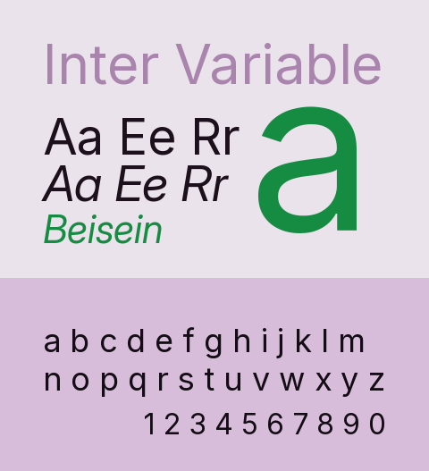

## Metropolis
https://github.com/dw5/Metropolis

Diese mag ich für Überschriften und größeren Text.

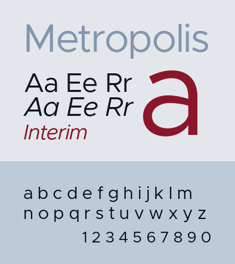

## IBM Plex Sans
https://github.com/IBM/plex

Die IBM-Plex-Schriftfamilie ist einfach eine schöne und sehr gut lesbare Schrift.

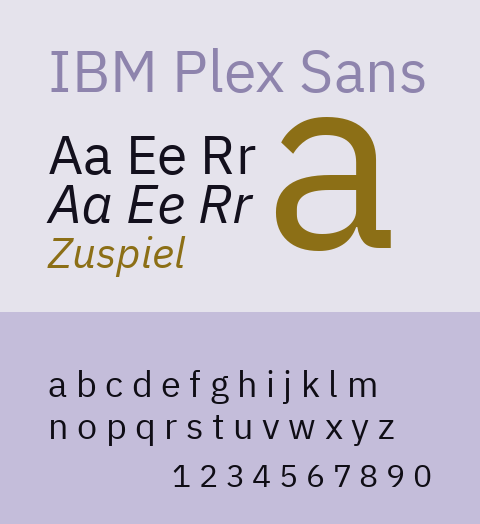

## Fira Sans
https://mozilla.github.io/Fira/

Im Auftrag der Mozilla Foundation und Telefonica S.A. für deren mobiles Betriebssystem entwickelt. Erinnert sehr an Erik Spiekermanns „FF Meta".

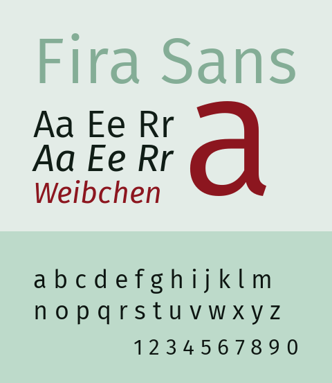

## Amstelvar
https://github.com/googlefonts/amstelvar

## Asap
https://www.omnibus-type.com/fonts/asap/

## Barlow
https://fonts.google.com/specimen/Barlow

## Bricolage Grotesque
https://ateliertriay.github.io/bricolage/

## Cabinet Grotesk
https://www.fontshare.com/fonts/cabinet-grotesk

## Chivo
https://fonts.google.com/specimen/Chivo

## DINish
https://github.com/playbeing/dinish

## DM Sans
https://fonts.google.com/specimen/DM+Sans

## Encode Sans
https://fonts.google.com/specimen/Encode+Sans

## Epilogue
https://github.com/Etcetera-Type-Co/Epilogue

## Figtree
https://www.erikdkennedy.com/projects/figtree.html

## Geist
https://vercel.com/font

## Junction
https://theleagueofmoveabletype.com/junction

## Karrik
https://velvetyne.fr/fonts/karrik/

## League Spartan
https://theleagueofmoveabletype.com/league-spartan

## Lexend
https://fonts.google.com/specimen/Lexend

## Libertinus Sans
https://github.com/alerque/libertinus

## Manrope
https://fonts.google.com/specimen/Manrope

## Mozilla Text
https://github.com/mozilla/mozilla-type-family

## Nunito
https://github.com/googlefonts/nunito

## Oswald
https://fonts.google.com/specimen/Oswald

## Outfit
https://fonts.google.com/specimen/Outfit

## Playpen Sans
https://fonts.google.com/specimen/Playpen+Sans

## Plus Jakarta Sans
https://fonts.google.com/specimen/Plus+Jakarta+Sans

## Public Sans
https://github.com/uswds/public-sans

## Quicksand
https://github.com/ThomasJockin/QuicksandFamily

## Raleway
https://github.com/impallari/Raleway

## Roboto Flex
https://fonts.google.com/specimen/Roboto+Flex

## Routed Gothic
https://webonastick.com/fonts/routed-gothic/

## Satoshi
https://www.fontshare.com/fonts/satoshi

## Source Sans
https://adobe-fonts.github.io/source-sans/

## Space Grotesk
https://floriankarsten.github.io/space-grotesk/

## Syne
https://fonts.google.com/specimen/Syne

## Urbanist
https://fonts.google.com/specimen/Urbanist

## Varela Round
https://fonts.google.com/specimen/Varela+Round

## Vazirmatn
https://github.com/rastikerdar/vazirmatn

## Work Sans
https://weiweihuanghuang.github.io/Work-Sans/

# Die Klassiker
Das sind einfach die Klassiker.

## Tex Gyre

https://www.gust.org.pl/projects/e-foundry/tex-gyre/

Freie Alternativen für:
* Times (New) Roman → TeX Gyre Termes
* ITC Avantgarde → TeX Gyre Adventor
* Century Schoolbook → TeX Gyre Schola
* Palatino → Pagella
* ITC Zapf Chancery(R) → Tex Gyre Chorus
* ITC Bookman → TeX Gyre Bonum
* Courier → TeX Gyre Cursor
* Helvetica → TeX Gyre Heros

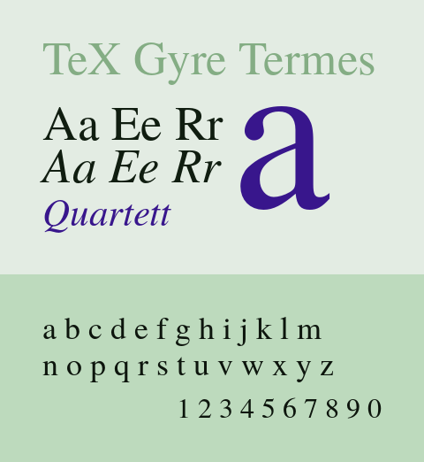
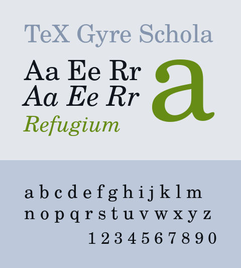
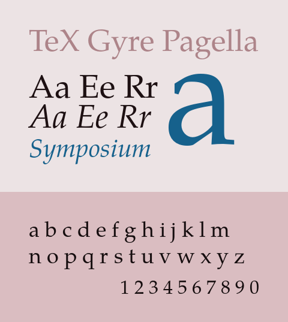
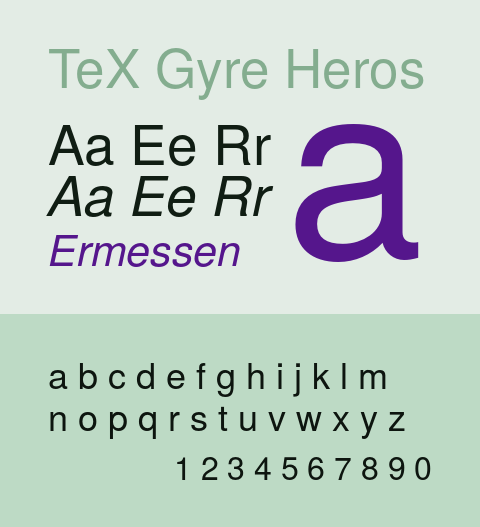

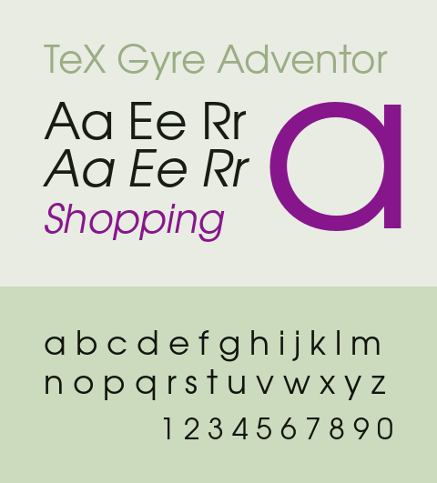
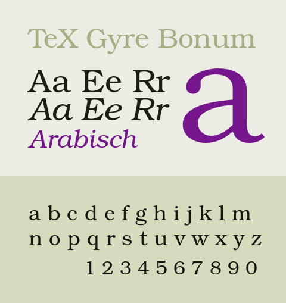

## Cormorant Garamond
https://github.com/CatharsisFonts/Cormorant

Kannte sie nicht vor Teuderun und mag sie sehr.


## Libre Caslon Text
https://github.com/impallari/Libre-Caslon-Text/

Caslon-Klon, speziell optimiert für Fließtext im Web. Auch verfügbar als [Libre Caslon Display](https://github.com/impallari/Libre-Caslon-Display/)

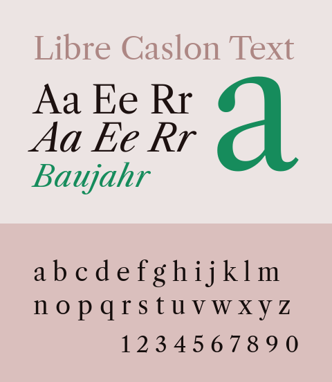

# Sehr schön zu haben

## Titillium
http://nta.accademiadiurbino.it/titillium/

Für wenn man einen etwas anderen Look braucht.

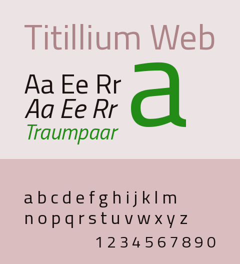

## Jost
https://github.com/indestructible-type/Jost

Ein etwas eleganteres Futura

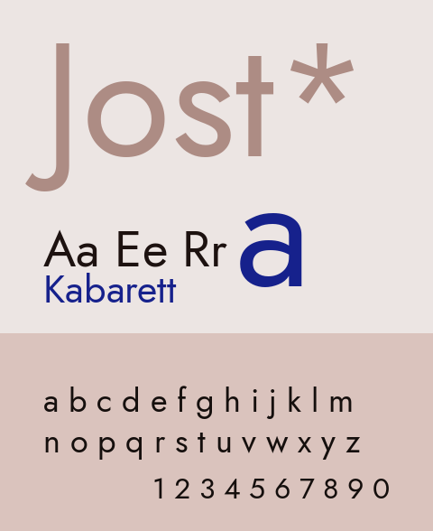

## Overpass
https://overpassfont.org/

Open-Source-Schrift, inspiriert von Highway Gothic auf amerikanischen Straßenschildern.

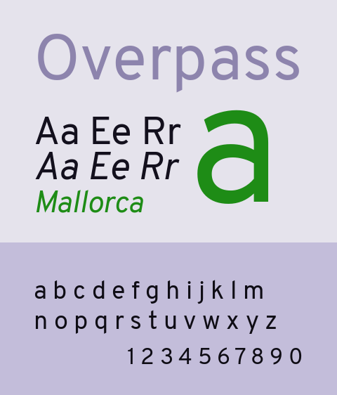

# Nichtproportional

## JetBrains Mono
https://github.com/jetbrains/jetbrainsmono

Sie ist einfach angenehm für meine Augen.

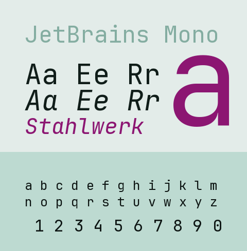

## Maple Mono
https://font.subf.dev/en/download/

Ich versuche, mich mit ihr anzufreunden.

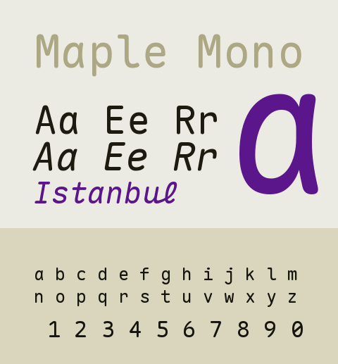

## Fira Code
https://github.com/tonsky/FiraCode

Meine frühere Monospace-Schrift. Ich lasse sie schweren Herzens hinter mir, aber JetBrains Mono ist einfach angenehmer anzuschauen.

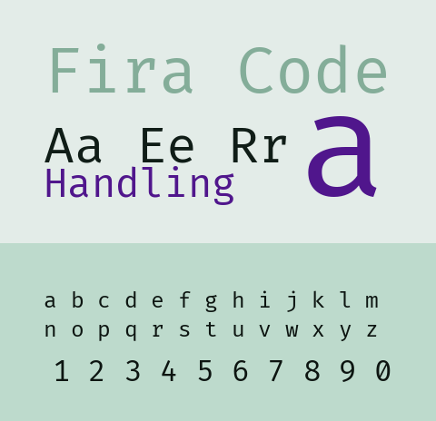

## Cascadia Code
https://github.com/microsoft/cascadia-code

Eigentlich nur wegen der kursiven Variante für Kommentare.

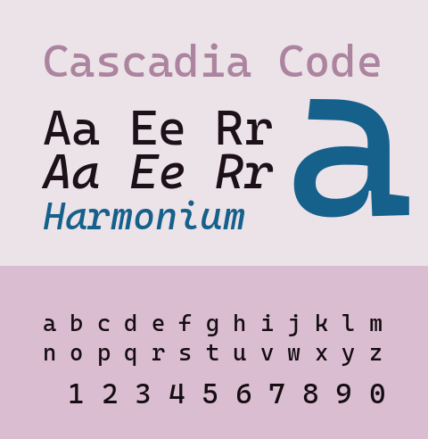

## 0xProto
https://github.com/0xType/0xProto

## Commit Mono
https://commitmono.com/

## Courier Prime
https://quoteunquoteapps.com/courierprime/

## Departure Mono
https://departuremono.com

## Geist Mono
https://github.com/vercel/geist-font

## Hack
https://github.com/source-foundry/Hack

## IBM Plex Mono
https://github.com/IBM/plex

## Libertinus Mono
https://github.com/alerque/libertinus

## Monaspace
https://monaspace.githubnext.com

## Recursive
https://www.recursive.design

## Source Code Pro
https://github.com/adobe-fonts/source-code-pro

## Space Mono
https://fonts.google.com/specimen/Space+Mono

## Victor Mono
https://rubjo.github.io/victor-mono/

# Schreibschriften

## Amatic SC
https://fonts.google.com/specimen/Amatic+SC

## Because We Had To
https://github.com/RedHatOfficial/bwht-fonts

Sechs Handschriften, die Red Hat 2019 für die Artikelserie „Because We Had To" aus der
Handschrift von Freundinnen und Kolleginnen entwickelte: Build, Connect, Create, Learn,
Mentor, Organize. Alle bis auf Learn nutzen `calt`, um wiederkehrende Buchstaben zu variieren.

## Caveat
https://fonts.google.com/specimen/Caveat

## Dancing Script
https://fonts.google.com/specimen/Dancing+Script

## Great Vibes
https://github.com/googlefonts/great-vibes

## Pacifico
https://fonts.google.com/specimen/Pacifico

## Playwrite
https://github.com/TypeTogether/Playwrite

## Sansita Swashed
https://www.omnibus-type.com/fonts/sansitaswashed/

## Satisfy
https://fonts.google.com/specimen/Satisfy

## Tangerine
https://github.com/googlefonts/TangerineFont

## TeX Gyre Chorus
https://www.gust.org.pl/projects/e-foundry/tex-gyre/chorus

# Display

## Anton
https://fonts.google.com/specimen/Anton

## Anybody
https://fonts.google.com/specimen/Anybody

## Bebas Neue
https://fonts.google.com/specimen/Bebas+Neue

## Big Shoulders Display
https://fonts.google.com/specimen/Big+Shoulders+Display

## Big Shoulders Stencil
https://github.com/xotypeco/big_shoulders

## Climate Crisis
https://github.com/dancoull/ClimateCrisis

Variable Achse `YEAR` (1979–2050) statt Gewicht: die Buchstaben erodieren mit fortschreitendem
Jahr wie das arktische Meereis.

## Pixelify Sans
https://github.com/eifetx/Pixelify-Sans

## Saira Stencil One
https://github.com/Omnibus-Type/Saira

## Dela Gothic One
https://fonts.google.com/specimen/Dela+Gothic+One

## Silkscreen
https://kottke.org/plus/type/silkscreen/

# Blackletter

## Fette Fraktur
**Keine freie Quelle.** Die früher hier eingetragene Google-Fonts-URL ist ein 404 — „Fette Fraktur"
gibt es dort nicht, und eine freie Digitalisierung existiert nicht. Als Ersatz mit eigener
Projektseite: [Plakat Fraktur](http://www.peter-wiegel.de/PlakatFraktur.html) oder
[Ganz Grobe Gotisch](http://www.peter-wiegel.de/GanzGrobe.html) (Peter Wiegel).

## Grenze Gotisch
https://www.omnibus-type.com/fonts/grenze-gotisch/

## Jacquarda Bastarda 9
https://github.com/scfried/soft-type-jacquarda-bastarda

## Grenze
https://www.omnibus-type.com/fonts/grenze/

## Unifraktur
https://unifraktur.sourceforge.net/

## UnifrakturCook
https://unifraktur.sourceforge.net/

# Nicht Comic Sans

Die _einzige_ angemessene Verwendung von „Comic Sans" laut [Comic Sans Criminal](https://comicsanscriminal.com/):

> * Das Publikum ist unter 11 Jahre alt
> * Man gestaltet einen Comic
> * Das Publikum ist legasthenisch und hat angegeben, Comic Sans zu bevorzugen

Spaß beiseite: Comic Sans verletzt keine Menschen, Menschen verletzen Menschen.

## Krikikrak
https://www.carrois.com/typefaces/retail/Krikikrak/

Wenn man schon an _Comic Sans_ denkt – warum nicht gleich das innere Kind voll ausleben und Krikikrak verwenden?

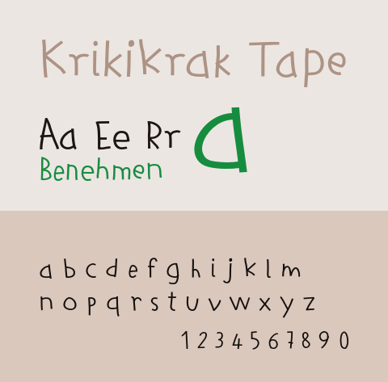

## Komika Hand
https://www.1001fonts.com/komika-font.html

Niemand muss Comic Sans benutzen, aber man könnte auch einfach voll auf Comic-Modus gehen.

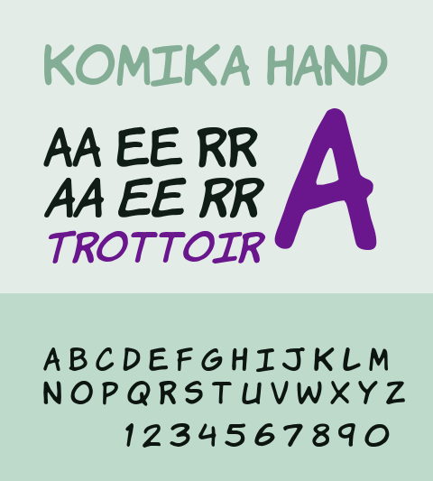

## Kalam
https://fonts.google.com/specimen/Kalam

Lieber nicht benutzen. Sie könnte das neue Comic Sans werden ;-)

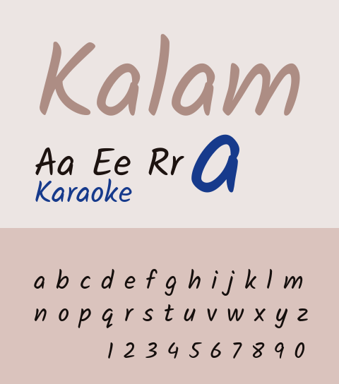
