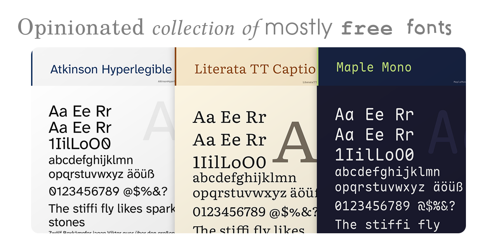

# Persönliche Sammlung von (größtenteils kostenlosen) Schriftarten

> Jeder hat eine Lieblingsschrift, oder? ODER!?

Das ist eine persönliche und eigenwillige Sammlung von Schriftarten, die mir im Gedächtnis geblieben sind und vor allem und ein Vorwand, den [font_specimen_generator.py](./font_specimen_generator.py) vorzuführen (den ich Claude zusammen schustern ließ). Diese Liste ist außerdem von [Teuderun](https://www.teuderun.de/schriftarten/top-10/) beeinflusst.


## Neue Schrift hinzufügen

### Notwendige Schritte

1. **Ordner anlegen** — `src/webfonts/<Kategorie>/<SchriftName>/`  
   Kategorie frei wählbar, z. B. `sans`, `serif`, `mono`, `script`, `blackletter`.

2. **`.woff2`-Dateien ablegen** — Namensschema: `SchriftName_Gewicht.woff2`  
   Beispiele: `Jost_Regular.woff2`, `Jost_Bold.woff2`, `Jost_BoldItalic.woff2`  
   Variable Fonts: Dateiname muss `Variable` oder `[wght]` enthalten.

3. **`meta.yaml` erstellen** — Pflicht: `tags` (erster Tag bestimmt URL-Segment und Kategorie)
   ```yaml
   title: Meine Schrift
   tags: Sans, Humanist Sans      # erster Tag → URL /sans/meineschrift.html
   ```

4. **Build starten** — `npx gulp`  
   Die Specimen-Seite erscheint automatisch unter `/<erster-tag>/<schriftname>.html`.

---

### Optionale meta.yaml-Felder

| Feld | Beispiel | Wirkung |
|---|---|---|
| `color` | `steelblue` | Akzentfarbe (CSS-Farbname) |
| `heroword` | `Airport` | Großes Wort im Hero-Bereich |
| `heroletter` | `Aa` | Zeichen im CMYK-Hero |
| `herostyle` | `bold` | CSS font-weight für heroword |
| `border` | `floral.svg` | Rahmen-SVG (aus `src/img/borders/`) |
| `fontauthor` | `Rasmus Andersson` | Gestalter-Name |
| `fontyear` | `2017` | Erscheinungsjahr |
| `wikipedia` | `https://…` | Link zur Wikipedia-Seite |
| `content` | `Markdown-Text` | Freitext unter dem Specimen |
| `comment` | `interner Hinweis` | Interne Notiz, nicht angezeigt |

### Optionale Bilder

- **Kartenhintegrund** — Bilder in `src/webfonts/<Kat>/<Schrift>/background/` ablegen (WebP bevorzugt)  
  Oder URLs in `background/urls.txt` eintragen (`unsplash:ID`, `pexels:ID`, direkte HTTPS-URL) → `npx gulp download`
- **Galerie** — Bilder in `src/webfonts/<Kat>/<Schrift>/gallery/` ablegen

---

### Lokalen Server starten

```bash
git clone https://github.com/elbym/font-collection
npm install
npx gulp            # Entwicklungsserver auf Port 3000
npx gulp build      # Produktions-Build
npx gulp deploy     # Deploy auf GitHub Pages
```

## Unten: Altes Specimen mit Python als Bilder

### Schriftartentabelle
> Liste der Schriftarten. In keiner bestimmten Reihenfolge.

* Serifenschriften
  - [Literata](#literata)
  - [IBM Plex Serif](#ibm-plex-serif)
  - [Libertinus](#libertinus)
* Serifenlose Schriften
  - [Atkinson Hyperlegible](#atkinson-hyperlegible)
  - [Inter](#inter)
  - [Metropolis](#metropolis)
  - [IBM Plex Sans](#ibm-plex-sans)
  - [Fira Sans](#fira-sans)
* Die klassischen Pflichtschriften
  - [Tex Gyre Collection](#tex-gyre)
  - [Cormorant Garamond](#cormorant-garamond)
  - [Libre Caslon](#libre-caslon-text)
* Sehr schön zu haben
  - [Titillium](#titillium)
  - [Jost](#jost)
  - [Overpass](#overpass)
* Nichtproportionale Schriften
  - [JetBrains Mono](#jetbrains-mono)
  - [Maple Mono](#maple-mono)
  - [Fira Code](#fira-code)
  - [Cascadia Code](#cascadia-code)
* Nicht Comic Sans
  - [Krikikrak](#krikikrak)
  - [Hand of Sean](#hand-of-sean)
  - [Komike Hand](#komika-hand)
  - [Kalam](#kalam)

# Werkzeuge
## Font Freeze
[FontFreeze](https://github.com/MuTsunTsai/fontfreeze): Wenn eine Schriftfunktion standardmäßig aktiviert oder vollständig aus einer Schrift entfernt werden soll. Ich habe es verwendet, um eine Version von „Cascadia Code" mit eingebautem [SS01](https://learn.microsoft.com/en-us/typography/opentype/spec/features_pt#ssxx) zu erstellen.

## python font_specimen_generator.py

Claude gebeten, ein Python-Skript zusammenzubasteln, das Schriftmuster-Vorschauen generiert – inspiriert von den Vorlagen auf [Wikipedia](https://commons.wikimedia.org/wiki/Category:Typeface_samples_(Font_Specimen_Creator);_raster_graphics)


Unterstützt derzeit 3 verschiedene Themes: cream, dark, white

Beispiele:

    python font_specimen_generator.py --input ./fonts --output ./previews
    python font_specimen_generator.py --input ./fonts --output ./previews --theme white
    python font_specimen_generator.py --input ./fonts --output ./previews --width 1400 --theme cream
    python font_specimen_generator.py --input ./fonts --output ./previews --overwrite


# Serifenschriften

## Literata
https://www.type-together.com/literata-font

Kannte sie nicht, bevor ich bei Teuderun darauf gestoßen bin – und ich mag sie sehr. Die Familie besteht aus:
* Literata Display
* Literata Subhead
* Literata Text

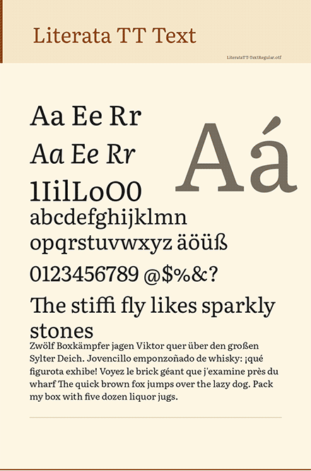

## IBM Plex Serif
https://github.com/IBM/plex

Ich mag die IBM-Plex-Schriften sehr. Sie treffen den klassischen Look und sind gut lesbar. Mit einem Hauch „Tech-Feeling".

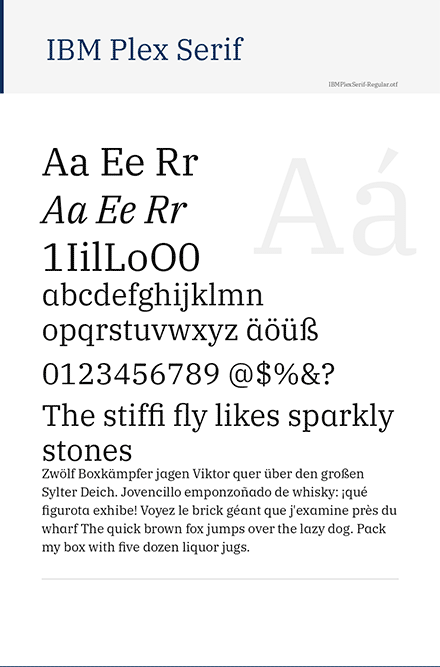

## Libertinus
https://github.com/alerque/libertinus

Libertinus ist der Nachfolger von Linux Libertine aus der TeX-Gyre-Sammlung. Die Familie besteht aus:
* Libertinus Serif
* Libertinus Serif Display
* Libertinus Sans

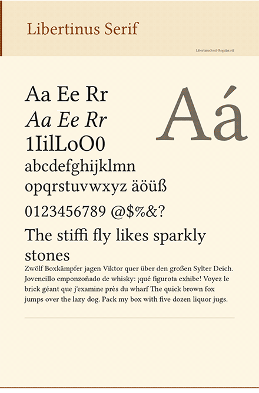

# Serifenlose Schriften

## Atkinson Hyperlegible
https://www.brailleinstitute.org/freefont/

Nomen est omen. Sehr gut lesbar. Ich mag sie und sie wächst mir immer mehr ans Herz.

Entwickelt vom Braille Institute of America ist diese Schrift darauf ausgelegt, für sehbehinderte Leser besonders gut lesbar zu sein – alle Zeichen sind so unterschiedlich wie möglich gestaltet.

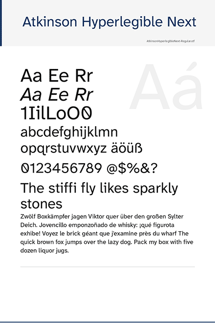

## Inter
https://rsms.me/inter/

Wie die Website es beschreibt: „Der Standard des 21. Jahrhunderts". Hat sogar eine schöne URL. Auch als Variable Font verfügbar.

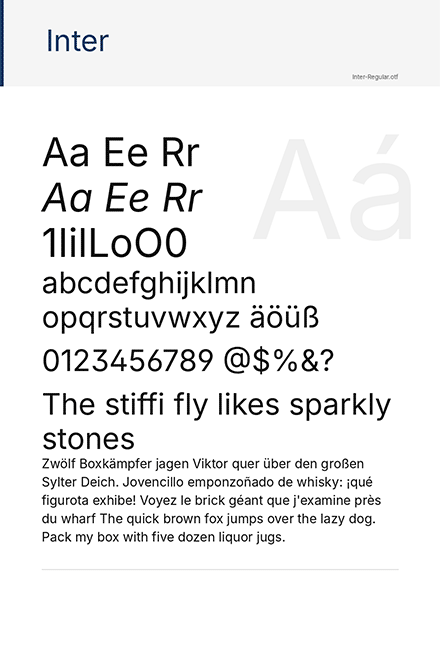

## Metropolis
https://github.com/dw5/Metropolis

Diese mag ich für Überschriften und größeren Text.

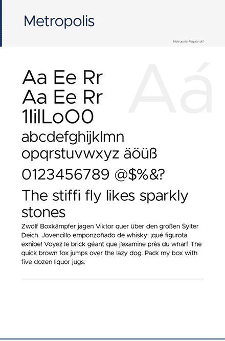

## IBM Plex Sans
https://github.com/IBM/plex

Die IBM-Plex-Schriftfamilie ist einfach eine schöne und sehr gut lesbare Schrift.

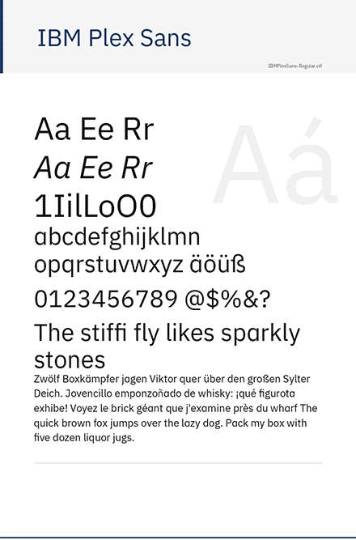

## Fira Sans
https://mozilla.github.io/Fira/

Im Auftrag der Mozilla Foundation und Telefonica S.A. für deren mobiles Betriebssystem entwickelt. Erinnert sehr an Erik Spiekermanns „FF Meta".

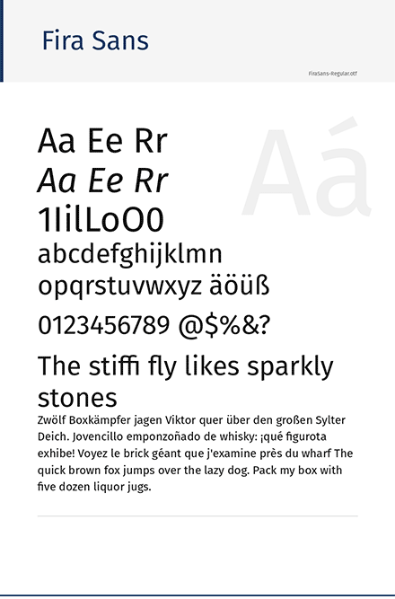

# Die Klassiker
Das sind einfach die Klassiker.

## Tex Gyre

https://www.gust.org.pl/projects/e-foundry/tex-gyre/

Freie Alternativen für:
* Times (New) Roman → TeX Gyre Termes
* ITC Avantgarde → TeX Gyre Adventor
* Century Schoolbook → TeX Gyre Schola
* Palatino → Pagella
* ITC Zapf Chancery(R) → Tex Gyre Chorus
* ITC Bookman → TeX Gyre Bonum
* Courier → TeX Gyre Cursor
* Helvetica → TeX Gyre Heros

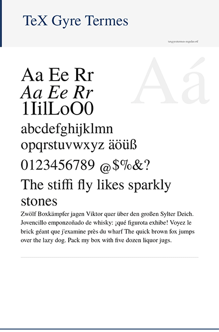
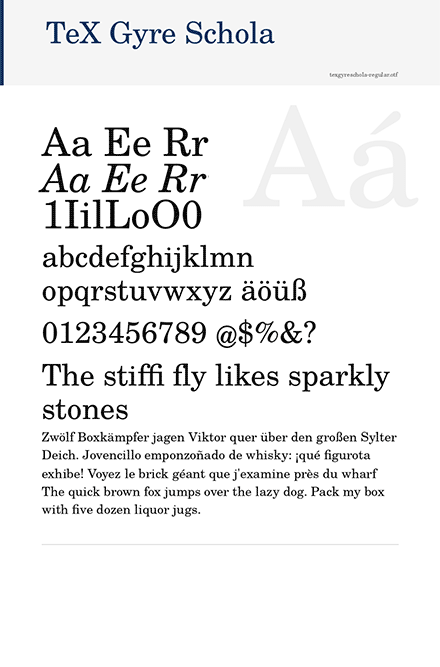
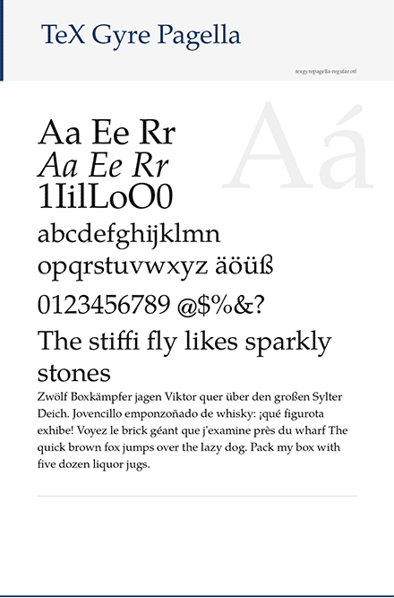
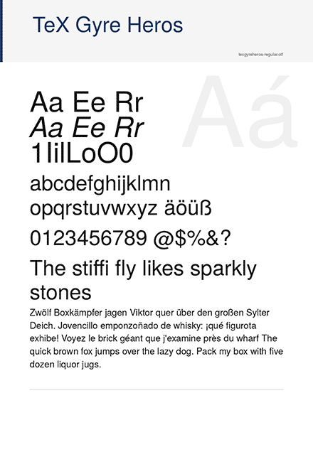
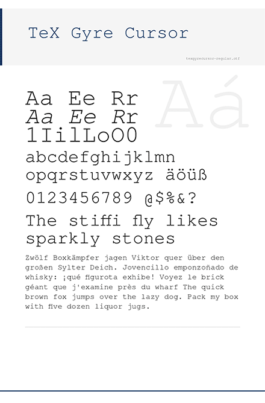
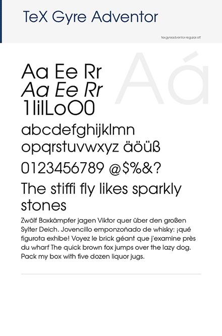
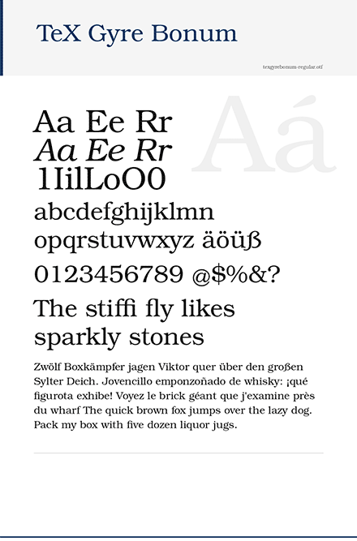

## Cormorant Garamond
https://github.com/CatharsisFonts/Cormorant

Kannte sie nicht vor Teuderun und mag sie sehr.

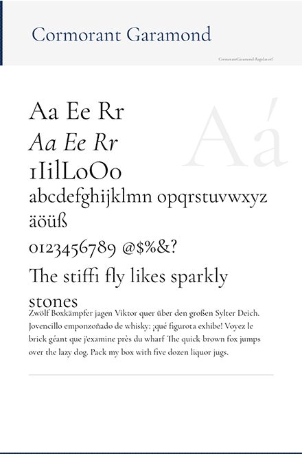

## Libre Caslon Text
https://github.com/impallari/Libre-Caslon-Text/

Caslon-Klon, speziell optimiert für Fließtext im Web. Auch verfügbar als [Libre Caslon Display](https://github.com/impallari/Libre-Caslon-Display/)

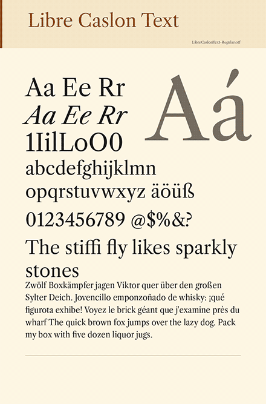

# Sehr schön zu haben

## Titillium
http://nta.accademiadiurbino.it/titillium/

Für wenn man einen etwas anderen Look braucht.

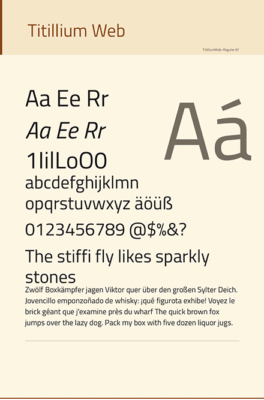

## Jost
https://github.com/indestructible-type/Jost

Ein etwas eleganteres Futura

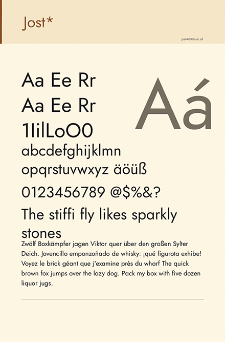

## Overpass
https://overpassfont.org/

Open-Source-Schrift, inspiriert von Highway Gothic auf amerikanischen Straßenschildern.

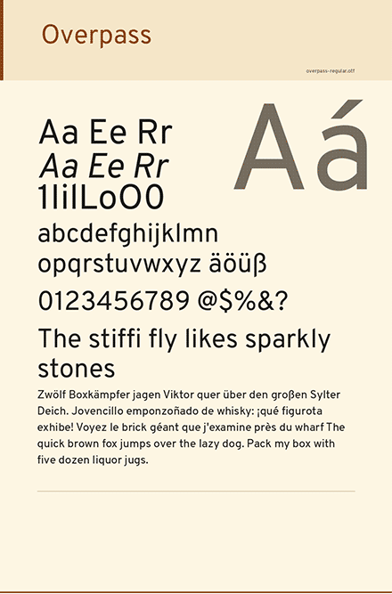

# Nichtproportional

## JetBrains Mono
https://github.com/jetbrains/jetbrainsmono

Sie ist einfach angenehm für meine Augen.

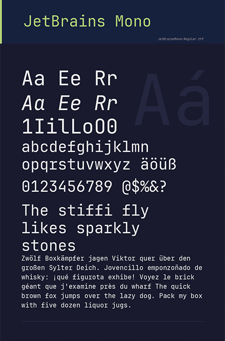

## Maple Mono
https://font.subf.dev/en/download/

Ich versuche, mich mit ihr anzufreunden.

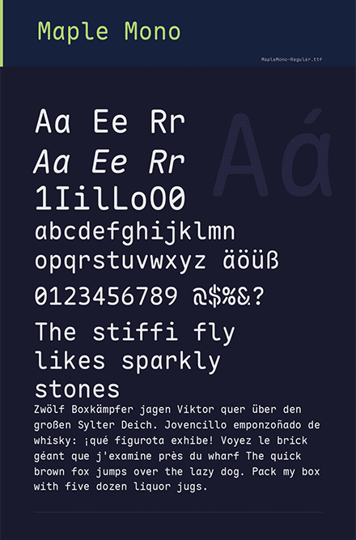

## Fira Code
https://github.com/tonsky/FiraCode

Meine frühere Monospace-Schrift. Ich lasse sie schweren Herzens hinter mir, aber JetBrains Mono ist einfach angenehmer anzuschauen.

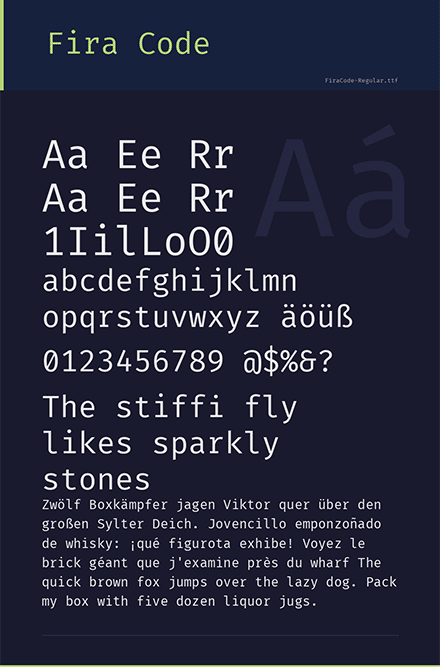

## Cascadia Code
https://github.com/microsoft/cascadia-code

Eigentlich nur wegen der kursiven Variante für Kommentare.

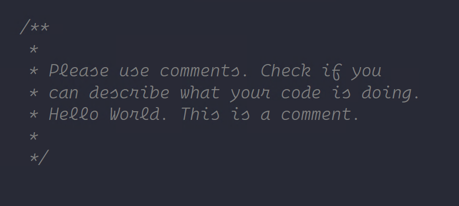


# Nicht Comic Sans

Die _einzige_ angemessene Verwendung von „Comic Sans" laut [Comic Sans Criminal](https://comicsanscriminal.com/):

> * Das Publikum ist unter 11 Jahre alt
> * Man gestaltet einen Comic
> * Das Publikum ist legasthenisch und hat angegeben, Comic Sans zu bevorzugen

Spaß beiseite: Comic Sans verletzt keine Menschen, Menschen verletzen Menschen.

## Krikikrak
https://www.carrois.com/typefaces/retail/Krikikrak/

Wenn man schon an _Comic Sans_ denkt – warum nicht gleich das innere Kind voll ausleben und Krikikrak verwenden?

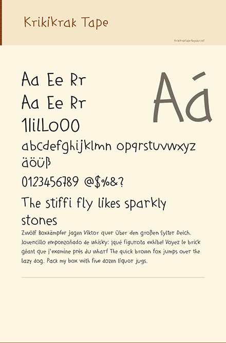

## Komika Hand
https://www.1001fonts.com/komika-font.html

Niemand muss Comic Sans benutzen, aber man könnte auch einfach voll auf Comic-Modus gehen.

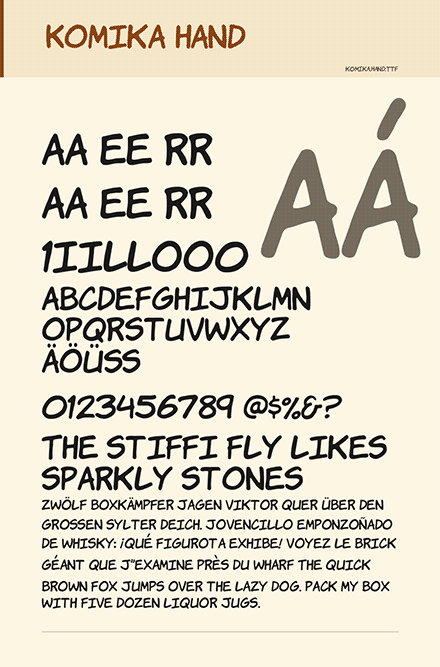

## Kalam
https://fonts.google.com/specimen/Kalam

Lieber nicht benutzen. Sie könnte das neue Comic Sans werden ;-)

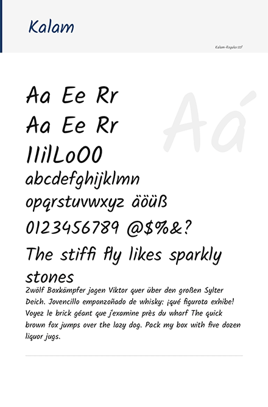
